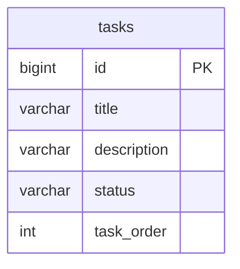
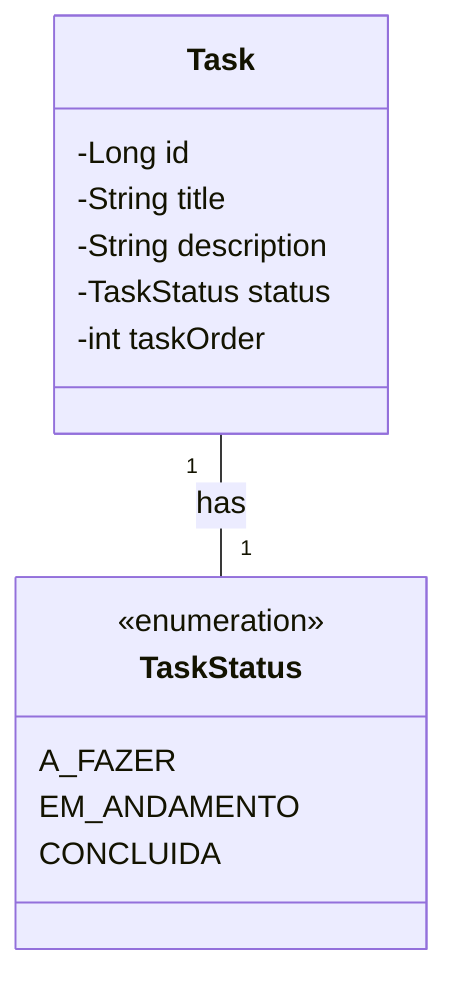

# 🚀 Construindo uma API REST de Tarefas com Spring Boot

Bem-vindo ao nosso guia passo a passo para construir uma API RESTful completa para um quadro de tarefas no estilo Kanban. Ao final deste tutorial, você terá um backend robusto, seguro e pronto para ser consumido por qualquer cliente, como uma aplicação web em Angular.

## 🎯 Objetivo do Projeto

Nosso objetivo é criar uma API que gerencie tarefas, permitindo:
- Listar todas as tarefas.
- Criar uma nova tarefa.
- Atualizar uma tarefa existente (incluindo seu status, o que é essencial para a funcionalidade de arrastar e soltar).
- Deletar uma tarefa.

### ⚙️ Tecnologias Utilizadas

- **Java 21**: A versão mais recente do Java, com recursos modernos.
- **Spring Boot 3**: Para criar a aplicação de forma rápida e com o mínimo de configuração.
- **Spring Data JPA**: Para simplificar o acesso e a persistência de dados.
- **Maven**: Para gerenciamento de dependências e build do projeto.
- **H2 Database**: Um banco de dados em memória, perfeito para desenvolvimento e testes.
- **MySQL**: Como nosso banco de dados para o ambiente de produção.
- **Lombok**: Para reduzir código repetitivo (boilerplate).

### 🗺️ Caso de Uso Principal

O diagrama abaixo ilustra como um "Usuário" irá interagir com nosso sistema de tarefas.

```mermaid
usecaseDiagram
    actor "Usuário" as User
    rectangle "Sistema de Tarefas" {
        User -- (Listar Tarefas)
        User -- (Criar Tarefa)
        User -- (Atualizar Tarefa)
        User -- (Mover Tarefa entre Colunas)
        User -- (Deletar Tarefa)
    }
    (Atualizar Tarefa) <.. (Mover Tarefa entre Colunas) : extends
```

---

## 📦 Módulo 1: Configurando o Ambiente e o Projeto

Nesta primeira etapa, vamos preparar nosso ambiente e criar o esqueleto do projeto Spring Boot.

### ### 1. Pré-requisitos

- **JDK 21** instalado.
- **Maven** instalado e configurado no PATH do sistema.
- Uma **IDE** de sua preferência (IntelliJ IDEA, VS Code com extensões Java, ou Eclipse).

### ### 2. Criando o Projeto com Spring Initializr

A maneira mais fácil de iniciar um projeto Spring Boot é usando o [Spring Initializr](https://start.spring.io/).

Configure seu projeto com as seguintes opções:
- **Project**: Maven
- **Language**: Java
- **Spring Boot**: 3.4.3 (ou a mais recente estável)
- **Spring Boot**: 3.3.3 (ou a mais recente estável)
- **Project Metadata**:
  - **Group**: `com.dozenflow`
  - **Artifact**: `be`
  - **Name**: `dozenflow-be`
  - **Packaging**: Jar
  - **Java**: 21
- **Dependencies**:
  - Spring Web
  - Spring Data JPA
  - Lombok
  - H2 Database
  - MySQL Driver
  - Spring Boot DevTools
  - Validation

Clique em **GENERATE** para baixar o arquivo `.zip`, descompacte-o e abra-o na sua IDE.

### ### 3. Estrutura de Pastas do Projeto

Vamos organizar nosso projeto em um estilo **monorepo**, onde o backend e o frontend (que será criado futuramente) residem no mesmo repositório Git, mas em pastas separadas.

```
/dozenflow-project/
├── backend/      <-- Nosso projeto Spring Boot está aqui
│   ├── pom.xml
│   └── src/
└── frontend/     <-- Futuramente, o projeto Angular ficará aqui
```

---

## 🗄️ Módulo 2: Modelando Nossos Dados

Agora, vamos definir a estrutura dos nossos dados criando a entidade `Task`.

### ### 1. Criando o Pacote `task`

Dentro de `src/main/java/com/dozenflow/be`, crie um novo pacote chamado `task`. É aqui que toda a lógica relacionada a tarefas irá residir.

### ### 2. Criando o Enum `TaskStatus`

Um `Enum` é a forma ideal de representar um conjunto fixo de constantes, como os status de uma tarefa.

> **Arquivo**: `backend/src/main/java/com/dozenflow/be/task/TaskStatus.java`
```java
package com.dozenflow.be.task;

public enum TaskStatus {
    A_FAZER, EM_ANDAMENTO, CONCLUIDA
}
```

### ### 3. Criando a Entidade `Task`

Esta classe será mapeada para uma tabela no nosso banco de dados.

> **Arquivo**: `backend/src/main/java/com/dozenflow/be/task/Task.java`
```java
package com.dozenflow.be.task;

import jakarta.persistence.*;
import lombok.Data;

@Data
@Entity
@Table(name = "tasks")
public class Task {

    @Id
    @GeneratedValue(strategy = GenerationType.IDENTITY)
    private Long id;

    @Column(nullable = false)
    private String title;

    private String description;

    @Enumerated(EnumType.STRING)
    @Column(nullable = false)
    private TaskStatus status;

    @Column(name = "task_order")
    private int taskOrder;
}
```

### ### 4. Diagramas do Modelo

**Diagrama de Entidade e Relacionamento (ER)**


**Diagrama de Classes**


---

## 💾 Módulo 3: A Camada de Persistência

Vamos criar a interface que se comunicará com o banco de dados e configurar nossas fontes de dados.

### ### 1. Criando o `TaskRepository`

O Spring Data JPA fará toda a mágica para nós. Apenas precisamos definir a interface.

> **Arquivo**: `backend/src/main/java/com/dozenflow/be/task/TaskRepository.java`
```java
package com.dozenflow.be.task;

import org.springframework.data.jpa.repository.JpaRepository;
import org.springframework.stereotype.Repository;
import java.util.List;

@Repository
public interface TaskRepository extends JpaRepository<Task, Long> {
    List<Task> findAllByOrderByTaskOrderAsc();
}
```

### ### 2. Configurando os Perfis de Banco de Dados

Usaremos perfis do Spring para gerenciar as configurações de desenvolvimento (H2) e produção (MySQL).

> **Arquivo**: `backend/src/main/resources/application.properties`
```properties
spring.profiles.active=dev
```

> **Arquivo**: `backend/src/main/resources/application-dev.properties`
```properties
# DEVELOPMENT PROFILE (H2)
spring.h2.console.enabled=true
spring.h2.console.path=/h2-console
spring.datasource.url=jdbc:h2:mem:dozendb;DB_CLOSE_DELAY=-1
spring.datasource.driverClassName=org.h2.Driver
spring.datasource.username=sa
spring.datasource.password=
spring.jpa.show-sql=true
spring.jpa.hibernate.ddl-auto=create-drop
spring.jpa.defer-datasource-initialization=true
spring.jpa.open-in-view=false
```

> **Arquivo**: `backend/src/main/resources/application-prod.properties`
```properties
# PRODUCTION PROFILE (MySQL)
spring.datasource.url=jdbc:mysql://localhost:3306/dozendb?useSSL=false&serverTimezone=UTC
spring.datasource.username=your_mysql_user
spring.datasource.password=your_mysql_password
spring.jpa.hibernate.ddl-auto=validate
```

### ### 3. Populando o Banco com Dados Iniciais

Crie um arquivo `data.sql` para que o Spring o execute na inicialização, populando nosso banco de dados de desenvolvimento.

> **Arquivo**: `backend/src/main/resources/data.sql`
```sql
INSERT INTO tasks (title, description, status, task_order) VALUES ('Configurar o Backend', 'Criar a API com Spring Boot.', 'CONCLUIDA', 0);
INSERT INTO tasks (title, description, status, task_order) VALUES ('Desenvolver o Frontend', 'Estruturar o projeto Angular.', 'EM_ANDAMENTO', 0);
INSERT INTO tasks (title, description, status, task_order) VALUES ('Implementar Drag-and-Drop', 'Usar o Angular CDK.', 'A_FAZER', 0);
```

---

## 💼 Módulo 4: A Lógica de Negócio e a API

Neste módulo, construiremos o cérebro da nossa aplicação: o `Service`, os `DTOs` e o `Controller`.

### ### 1. Criando DTOs (Data Transfer Objects)

É uma boa prática não expor nossas entidades JPA diretamente na API. Para isso, usamos DTOs. Crie o subpacote `dto` dentro de `com.dozenflow.be.task`.

> **Arquivo**: `backend/src/main/java/com/dozenflow/be/task/dto/TaskRequestDTO.java`
```java
package com.dozenflow.be.task.dto;

import com.dozenflow.be.task.TaskStatus;
import jakarta.validation.constraints.NotBlank;
import jakarta.validation.constraints.NotNull;

public record TaskRequestDTO(
        @NotBlank(message = "Title cannot be blank")
        String title,
        String description,
        @NotNull(message = "Status cannot be null")
        TaskStatus status,
        @NotNull(message = "Task order cannot be null")
        int taskOrder
) {}
```

### ### 2. Criando o `TaskService`

O serviço orquestra a lógica de negócio, usando o repositório para acessar os dados.

> **Arquivo**: `backend/src/main/java/com/dozenflow/be/task/TaskService.java`
```java
package com.dozenflow.be.task;

import com.dozenflow.be.task.dto.TaskRequestDTO;
import jakarta.persistence.EntityNotFoundException;
import org.springframework.stereotype.Service;
import org.springframework.transaction.annotation.Transactional;

import java.util.List;

@Service
public class TaskService {

    private final TaskRepository taskRepository;

    public TaskService(TaskRepository taskRepository) {
        this.taskRepository = taskRepository;
    }

    public List<Task> findAll() {
        return taskRepository.findAllByOrderByTaskOrderAsc();
    }

    public Task create(Task task) {
        return taskRepository.save(task);
    }

    @Transactional
    public Task update(Long id, TaskRequestDTO dto) {
        Task existingTask = taskRepository.findById(id)
                .orElseThrow(() -> new EntityNotFoundException("Task not found with id: " + id));

        existingTask.setTitle(dto.title());
        existingTask.setDescription(dto.description());
        existingTask.setStatus(dto.status());
        existingTask.setTaskOrder(dto.taskOrder());

        return taskRepository.save(existingTask);
    }

    public void delete(Long id) {
        if (!taskRepository.existsById(id)) {
            throw new EntityNotFoundException("Task not found with id: " + id);
        }
        taskRepository.deleteById(id);
    }
}
```

### ### 3. Criando o `TaskController`

O controller expõe nossa lógica de negócio como endpoints HTTP RESTful.

> **Arquivo**: `backend/src/main/java/com/dozenflow/be/task/TaskController.java`
```java
// O conteúdo do TaskController.java já fornecido no contexto, com a adição do @Valid.
// Cole o código aqui.
```

---

## 🛡️ Módulo 5: Tornando a API Robusta

Uma API profissional precisa lidar com erros de forma elegante.

### ### 1. Criando um Handler de Exceções Global

Vamos criar um handler que captura exceções e retorna respostas HTTP claras e consistentes. Crie o pacote `com.dozenflow.be.exception`.

> **Arquivo**: `backend/src/main/java/com/dozenflow/be/exception/GlobalExceptionHandler.java`
```java
package com.dozenflow.be.exception;

import jakarta.persistence.EntityNotFoundException;
import org.springframework.http.HttpStatus;
import org.springframework.http.ResponseEntity;
import org.springframework.web.bind.MethodArgumentNotValidException;
import org.springframework.web.bind.annotation.ControllerAdvice;
import org.springframework.web.bind.annotation.ExceptionHandler;

import java.util.HashMap;
import java.util.Map;

@ControllerAdvice
public class GlobalExceptionHandler {

    @ExceptionHandler(EntityNotFoundException.class)
    public ResponseEntity<String> handleEntityNotFound(EntityNotFoundException ex) {
        return new ResponseEntity<>(ex.getMessage(), HttpStatus.NOT_FOUND);
    }

    @ExceptionHandler(MethodArgumentNotValidException.class)
    public ResponseEntity<Map<String, String>> handleValidationExceptions(MethodArgumentNotValidException ex) {
        Map<String, String> errors = new HashMap<>();
        ex.getBindingResult().getFieldErrors().forEach(error ->
                errors.put(error.getField(), error.getDefaultMessage())
        );
        return new ResponseEntity<>(errors, HttpStatus.BAD_REQUEST);
    }
}
```

## ✅ Conclusão

Parabéns! Você construiu uma API RESTful completa, robusta e bem estruturada com Spring Boot. Você aprendeu sobre:
- Estrutura de projetos e pacotes.
- Mapeamento objeto-relacional com JPA.
- Separação de responsabilidades com a arquitetura Controller-Service-Repository.
- A importância de DTOs e validação.
- Tratamento de erros centralizado.

O próximo passo natural é construir o **frontend com Angular** para consumir esta API e criar a interface de arrastar e soltar. Bom trabalho!